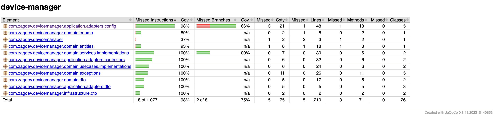

# Device Manager

## Table of Contents

* [About the Project](#about-the-project)
* [Architecture](#architecture)
* [How to Run Locally](#how-to-run-locally)
* [API Documentation](#api-documentation)
* [External Integrations](#external-integrations)
* [Tests & Coverage](#tests--coverage)
* [Possible Future Improvements](#possible-future-improvements)

---

## About the Project

Device Manager is a RESTful API for managing the device registry of a telecom operator. It allows registering, querying, and listing devices, as well as integrating with external APIs to fetch users. The project prioritizes REST best practices, efficiency, and clear documentation.

---

## Architecture

* **Spring Boot 3 / Java 21**
* **PostgreSQL** (persistence)
* **Springdoc OpenAPI** (Swagger) for API documentation
* **HTTP Integration** with public API (reqres.in)
* **Tests:** JUnit, Mockito, Spring Boot Test

The system follows a layered architecture (Controller, Service, Repository) with clear separation of concerns.

---

## How to Run Locally

### Prerequisites

* Java 21
* Docker + Docker Compose
* Maven

### Running everything with Docker Compose (recommended)

1. Run:

```bash
docker-compose up --build
```

The API will be available at:  
[http://localhost:8080](http://localhost:8080)

* PostgreSQL: `jdbc:postgresql://localhost:5432/devices`  
  User: `postgres` | Password: `postgres`

---

## API Documentation

Access the interactive API documentation via **Swagger UI**:

* [http://localhost:8080/documentation.html](http://localhost:8080/documentation.html)
* [http://localhost:8080/swagger-ui/index.html](http://localhost:8080/swagger-ui/index.html)

> Check request and response examples and explore all available flows directly in the interface.

---

## Detailed Architecture & Design Patterns

* **Domain Layer:** Device entity, business rules, and validations.
* **Application Layer:** Controllers, services, DTOs, and mappings.
* **Infrastructure:** Integration with PostgreSQL, external API consumption (reqres.in).
* **Centralized Exception Handler:** Global error handling with standardized responses.
* **Multi-level Testing:** Unit tests for business logic and integration tests for APIs and persistence.

### Patterns and Principles Used

* **RESTful:** HTTP conventions and best practices.
* **DTO / Mapper:** Separation of domain models and data transfer objects.
* **Validation:** Bean Validation for input data.
* **Concurrency:** Use of transactions and JPA control.

---

## External Integrations

The project consumes the public API [reqres.in](https://reqres.in/api/users?page=2) to list users.

* **Local endpoint:** `GET /users`
* **Example response:**
  ```json
  {
  "page": 2,
  "per_page": 6,
  "total": 12,
  "total_pages": 2,
  "data": [
    {
      "id": 7,
      "email": "michael.lawson@reqres.in",
      "first_name": "Michael",
      "last_name": "Lawson",
      "avatar": "https://reqres.in/img/faces/7-image.jpg"
    },
    {
      "id": 8,
      "email": "lindsay.ferguson@reqres.in",
      "first_name": "Lindsay",
      "last_name": "Ferguson",
      "avatar": "https://reqres.in/img/faces/8-image.jpg"
    },
    {
      "id": 9,
      "email": "tobias.funke@reqres.in",
      "first_name": "Tobias",
      "last_name": "Funke",
      "avatar": "https://reqres.in/img/faces/9-image.jpg"
    },
    {
      "id": 10,
      "email": "byron.fields@reqres.in",
      "first_name": "Byron",
      "last_name": "Fields",
      "avatar": "https://reqres.in/img/faces/10-image.jpg"
    },
    {
      "id": 11,
      "email": "george.edwards@reqres.in",
      "first_name": "George",
      "last_name": "Edwards",
      "avatar": "https://reqres.in/img/faces/11-image.jpg"
    },
    {
      "id": 12,
      "email": "rachel.howell@reqres.in",
      "first_name": "Rachel",
      "last_name": "Howell",
      "avatar": "https://reqres.in/img/faces/12-image.jpg"
    }
  ],
  "support": {
    "url": "https://contentcaddy.io?utm_source=reqres&utm_medium=json&utm_campaign=referral",
    "text": "Tired of writing endless social media content? Let Content Caddy generate it for you."
  }}
  ```

---

## Tests & Coverage



* Unit tests for business logic.
* Integration tests: APIs and persistence.
* To run all tests:

  ```bash
  ./mvnw test
  ```

---

## Possible Future Improvements

* Authentication/authorization on endpoints.
* CI/CD pipeline with automated builds, tests, and deployment.
* Internationalization of messages and responses.
* Caching for query endpoints.

---